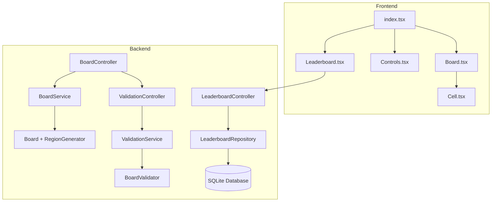

# Queens Puzzle (Next.js + Java Spring Boot)

An interactive logic puzzle inspired by the "LinkedIn Queens" game.  
Built to demonstrate full-stack software-engineering skills, from frontend interactivity to backend validation.

---

## Goal

Place exactly one queen in each row, column, and color region,  
while ensuring no two queens touch, not even diagonally.

---

## Features (so far)

- 7×7 interactive board
- Colored regions (hardcoded layout)
- Three-state cells: Empty → X → Queen
- Reset button and queen counter
- Backend integration for region data (`/api/board`)
- Validation endpoint (`/api/validate`)
- Dynamic board verification through frontend
- Responsive design for mobile and desktop

---

## Planned Next Steps

- [ ] Visual highlighting for invalid rows, columns, or regions
- [ ] Generate random puzzle boards
- [ ] Add solver algorithm for automated checks
- [ ] Refine validation feedback (more detailed UI hints)
- [ ] Deploy frontend (Vercel) and backend (Render or Railway)
- [ ] Add tests for backend logic and API responses

---

## Tech Stack

**Frontend:** Next.js (TypeScript) + Tailwind CSS  
**Backend:** Java 17 + Spring Boot  
**API Design:** REST (JSON)  
**Build Tool:** Maven  
**Version Control:** Git + GitHub  
**Hosting (planned):** Vercel (frontend)

---

## Project Structure

